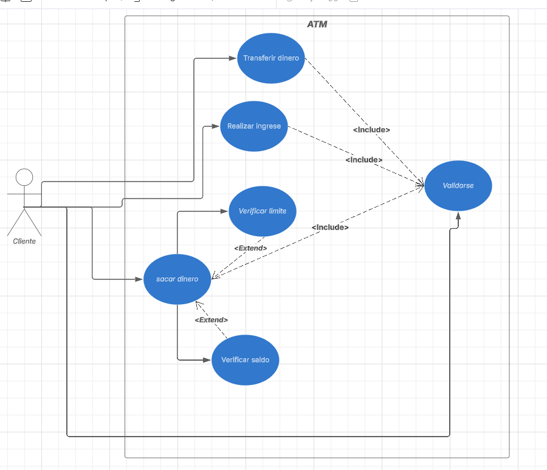

# Actividad 6.1

Diagrama de uso

Describir casos de usos

1. Sacar dinero

    1. El Cliente se valida
    2. El ATM valida al cliente
    3. El cliente ingresa la cantidad a retirar
    4. El ATM valida que tiene saldo suficiente
    5. El ATM valida que no supere el limite
    6. Si pasa ambas validaciones el ATM retira el dinero

Respondeer preguntas

1. Para que sirve

    1. Definir el alcance del sistema: Permite visualizar qué funcionalidades ofrece el sistema y quiénes las utilizarán.
    2 .Facilitar la comunicación: Sirve como un lenguaje común entre desarrolladores, analistas, clientes y otros interesados en el proyecto.
    3. Detectar requisitos funcionales: Ayuda a identificar y organizar los requisitos del sistema antes de su implementación.
    4. Mejorar la planificación: Permite anticipar posibles problemas en el diseño del sistema y optimizar su desarrollo.
    5. Documentar el sistema: Actúa como referencia en futuras mejoras, mantenimiento o ampliaciones.

2. Que aporta

    1. Claridad en la funcionalidad del sistema.
    2. Reducción de malentendidos entre el equipo de trabajo.
    3. Base para otros diagramas UML, como diagramas de secuencia o de clases.
    4. Ayuda en la validación de requisitos con el cliente antes de comenzar el desarrollo.
   
